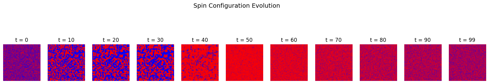
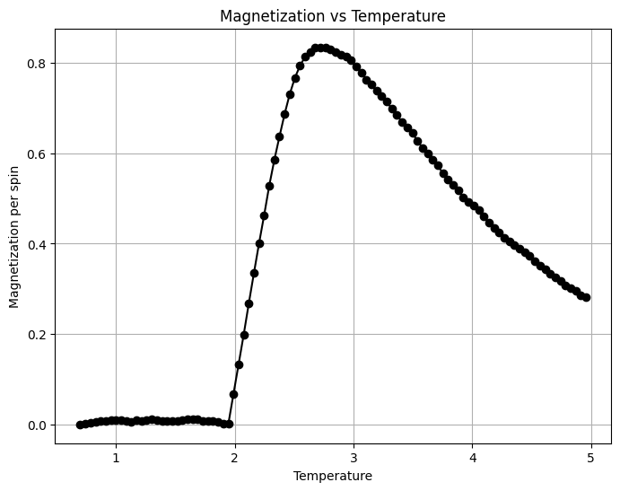
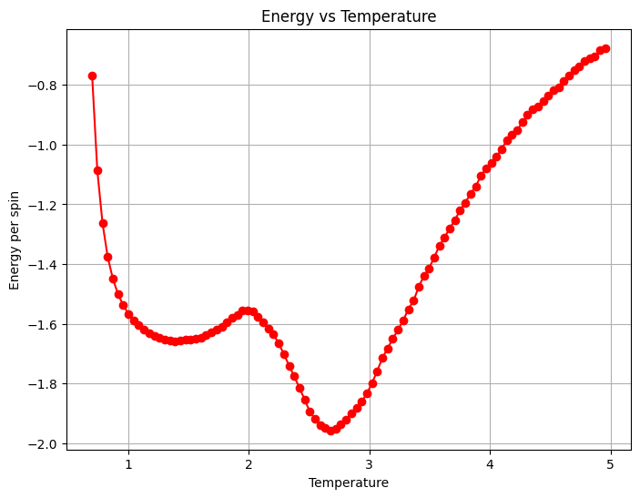
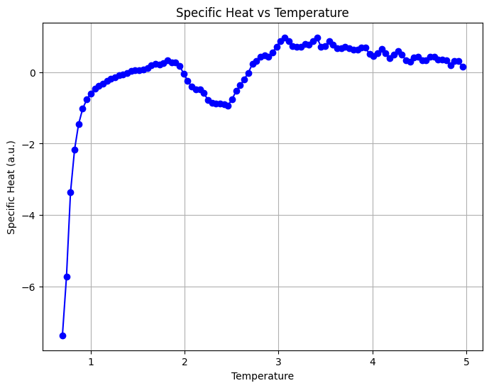

# 🧲 2D Ising Model Simulation

A **computational study of the 2D Ising model** using the **Metropolis–Hastings algorithm** with a **time-dependent temperature** and an **external magnetic field**.  
The simulation illustrates how spin alignment, magnetization, and energy evolve as temperature increases — including the effect of an applied magnetic field.

---

## ⚙️ Features

- 🧮 **Metropolis–Hastings Monte Carlo** evolution with periodic boundary conditions  
- 🌡️ **Dynamic temperature ramp** from an ordered (cold) to disordered (hot) state  
- 🧲 **External magnetic field application** at a specific timestep to induce alignment  
- 📈 **Measured observables:**  
  - Energy per spin  
  - Magnetization per spin  
  - Specific heat (computed from energy fluctuations)  
- 🖼️ **Snapshots of spin configurations** at various stages of thermal evolution  
- 📊 **High-quality plots:** Energy, magnetization, and specific heat vs temperature  

---

## 🧠 Background

The **Ising model** describes a system of interacting spins on a lattice, where each spin $s_i$ can take values $+1$ or $-1$.  
Spins interact with their nearest neighbors, and the system’s total energy is given by:

$$
E = -J \sum_{\langle i,j \rangle} s_i s_j - H \sum_i s_i
$$

where:
- $J$ is the exchange interaction strength (favoring alignment),
- $H$ is the external magnetic field.

At low temperatures, spins tend to **align** (ordered phase, high magnetization).  
As temperature increases, **thermal fluctuations** dominate, leading to **disorder** and zero net magnetization — the **paramagnetic phase**.

---

## 📊 Example Outputs

### 🔹 Spin Configuration Evolution

Visualization of the 2D lattice at selected timesteps showing spin-up (blue) and spin-down (red) regions.

### 🔹 Magnetization vs Temperature

The magnetization decreases with temperature as thermal agitation disrupts alignment.  
When an external magnetic field is applied, partial realignment occurs before further disordering.

### 🔹 Energy and Specific Heat

Energy decreases with ordering at low $T$ and increases again as the system becomes disordered.  
The specific heat peaks near the **critical temperature** $T_c \approx 2.27 J/k_B$, signaling the phase transition.

---

## 🧩 Model Details

| Parameter | Description | Value |
|------------|--------------|--------|
| Lattice size | Number of spins per dimension | 400 × 400 |
| Temperature range | Linear increase | 0.7 → 5.0 |
| External field | Applied after timestep 30 | H = 0.5 |
| Algorithm | Metropolis Monte Carlo (Numba-optimized) | — |
| Boundary conditions | Periodic | — |

---

## 📈 Simulation Outputs

The program prints a **summary table** of measured quantities:

| Step | Temperature | Energy | Magnetization | Specific Heat |
|------|--------------|--------|----------------|----------------|
| 0    | 0.70         | -1.78  | 0.96           | 0.02           |
| ...  | ...          | ...    | ...            | ...            |

and produces three plots:
1. **Energy vs Temperature**  
2. **Specific Heat vs Temperature**  
3. **Magnetization vs Temperature**

---

## 📝 License
This project is released under the [MIT License](LICENSE).

