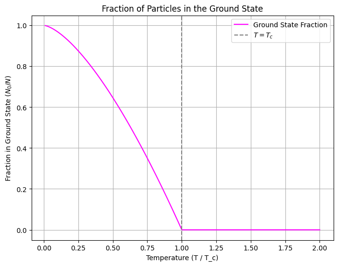
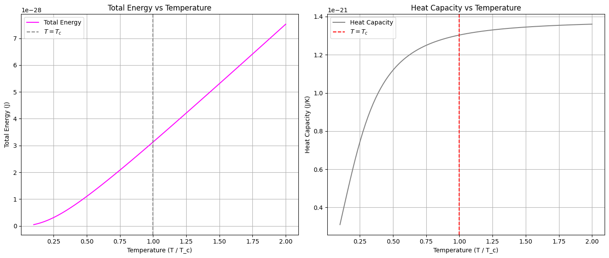
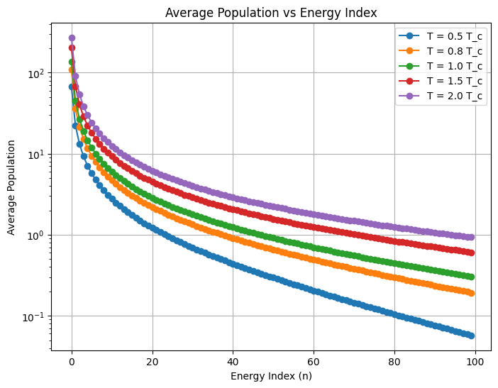

# ❄️ Bose-Einstein Condensation Simulation

A **computational simulation of Bose-Einstein condensation (BEC)** for a gas of rubidium-87 atoms in a 3D harmonic trap.

This project illustrates the **critical temperature**, the **fraction of particles in the ground state**, the **average occupation of energy levels**, and **thermodynamic properties** such as total energy and heat capacity as functions of temperature.

---

## ⚙️ Features

- 🧮 **Critical temperature:** $T_c$ for uniform and harmonically trapped gases  
- 💡 **Ground state fraction:** $N_0/N$ vs $T/T_c$  
- 🌐 **Bose-Einstein distribution:** Average occupation of discrete energy levels  
- 📊 **Thermodynamic properties:** Total energy $E(T)$ and heat capacity $C(T)$  
- 🎨 **High-quality plots:** Temperature-dependent behavior and energy populations  

---

## 🧠 Background

Bose-Einstein condensation occurs when a dilute gas of bosons occupies the **same quantum ground state** at very low temperatures. The critical temperature for condensation is:

$$
T_c = \frac{2 \pi \hbar^2}{k_B m} \left( \frac{n}{\zeta(3/2)} \right)^{2/3} \quad \text{(uniform gas)}
$$

In a 3D harmonic trap, the critical temperature is approximately:

$$
T_c = \frac{\hbar \omega}{k_B} \left( \frac{N}{\pi} \right)^{1/3}
$$

The **Bose-Einstein distribution** gives the average occupation of each energy level:

$$
\langle n_i \rangle = \frac{1}{e^{\varepsilon_i / k_B T} - 1}
$$

Thermodynamic properties such as **total energy** and **heat capacity** are computed by summing over the populated states:

$$
E(T) = \sum_i \langle n_i \rangle \varepsilon_i, \quad
C(T) = \frac{dE}{dT}
$$

---

## 📊 Example Outputs

### 🔹 Ground State Fraction

Fraction of particles in the ground state $N_0/N$ as a function of normalized temperature $T/T_c$.

### 🔹 Total Energy & Heat Capacity

Total energy $E(T)$ and heat capacity $C(T)$ showing the characteristic change near $T_c$.

### 🔹 Average Population vs Energy Level

Average occupation of energy levels for selected temperatures, illustrating how particles condense into the ground state as $T \to T_c$.

---

## 📝 License
This project is released under the [MIT License](LICENSE).

